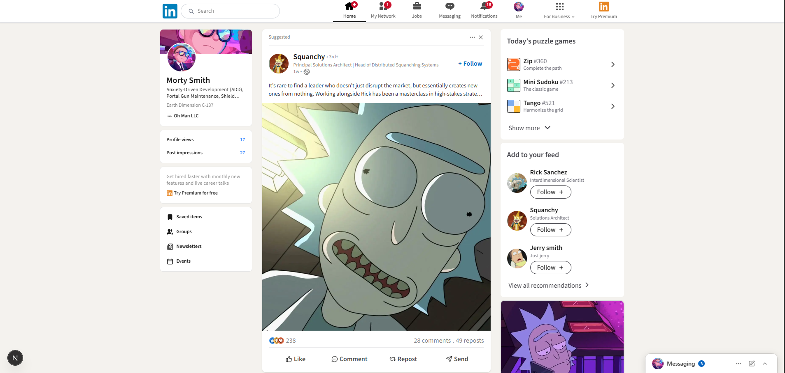

# LinkedIn Clone – Homepage

LinkedIn homepage clone built with **Next.js**.  
This project recreates the core layout and UI of LinkedIn’s homepage, focusing on responsive design, reusable components, and modern frontend practices.


## Tech Stack

- **Next.js**
- **React**
- **Tailwind**
- **TypeScript**

## Installation

Clone the repository:

```bash
git clone https://github.com/yourusername/linkedin-clone.git
cd linkedin-clone
npm install
npm run dev
```

then from browser open:

```bash
http://localhost:3000
```

## Screenshot
